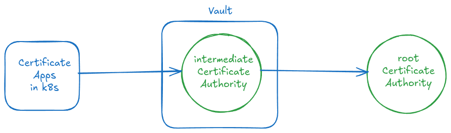

# Инструкция по настройке Удостоверяющего Центра (CA) на базе HashiCorp Vault и OpenSSL в Kubernetes

## Обзор

Эта инструкция представляет собой полное руководство по развертыванию отказоустойчивого кластера HashiCorp Vault в Kubernetes и настройке двухуровневой Public Key Infrastructure (PKI). **Корневой сертификат и промежуточный CA создаются через OpenSSL, но промежуточный импортируется и настраивается в Vault** для повседневного выпуска сертификатов. Инфраструктура интегрируется с `cert-manager` для автоматического управления жизненным циклом TLS-сертификатов.

**Важная особенность:** Vault работает полностью внутри кластера по HTTP, а весь TLS-терминация происходит на Ingress-контроллере, что обеспечивает дополнительный уровень безопасности.



**План:**

1.  **Установка Vault в Kubernetes:** Развертывание отказоустойчивого кластера Vault с использованием Helm-чарта и встроенного хранилища Raft, с активацией Ingress непосредственно в чарте.
2.  **Создание корневого и промежуточного сертификатов через OpenSSL:** Генерация корневого сертификата `apatsev.corp` и промежуточного CA `intermediate.apatsev.corp` с помощью OpenSSL.
3.  **Импорт промежуточного сертификата в Vault:** Настройка PKI-движка в Vault для промежуточного CA.
4.  **Интеграция с cert-manager:** Установка и настройка `cert-manager` для автоматизации выпуска и обновления сертификатов.
5.  **Настройка Ingress для Vault через Helm:** Активация и конфигурация Ingress непосредственно в Helm-чарте Vault для безопасного доступа с автоматическим созданием TLS-сертификата.
6.  **Создание ролей и выпуск сертификатов для приложений:** Демонстрация процесса создания ролей для различных сервисов и автоматического выпуска сертификатов для них.

## Предварительные требования

*   Рабочий кластер Kubernetes.
*   Установленные утилиты командной строки: `kubectl`, `helm`, `openssl`, `jq`, `vault`.
*   Настроенный доступ `kubectl` к целевому кластеру.
*   Установленный и настроенный Ingress-контроллер (например, nginx-ingress).

### **Шаг 1: Установка HashiCorp Vault в режиме HA в Kubernetes с активацией Ingress**

Используется официальный Helm-чарт от HashiCorp для развертывания Vault в отказоустойчивом режиме (HA) с использованием встроенного хранилища Raft и встроенного Ingress.

**1.1. Добавление Helm-репозитория HashiCorp:**
```bash
helm repo add hashicorp https://helm.releases.hashicorp.com
helm repo update
```

**Проверка:**
```bash
helm repo list | grep hashicorp
```

**1.2. Создание файла конфигурации values.yaml с активированным Ingress:**
*Файл конфигурации определяет параметры развертывания Vault: режим HA, количество реплик, бэкенд-хранилище и настройки Ingress.*
```yaml
server:
  ha:
    enabled: true
    raft:
      enabled: true
  service:
    enabled: true
    type: ClusterIP
ui:
  enabled: true
  service:
    type: ClusterIP
```

**1.3. Установка Vault с помощью Helm:**
*Команда создает пространство имен и устанавливает Vault с заданной конфигурацией, включая Ingress.*
```bash
kubectl create namespace vault
helm install vault hashicorp/vault --namespace vault --wait --values vault-values.yaml
```

**Проверка:** Дождитесь запуска всех подов и создания Ingress ресурса.
```bash
kubectl get pods -n vault
kubectl get ingress -n vault
```

**1.4. Инициализация и распечатывание Vault:**
*Инициализация генерирует корневой токен и ключи для распечатывания. Ключи необходимо сохранить в безопасном месте.*
```bash
kubectl exec -n vault vault-0 -- vault operator init -key-shares=1 -key-threshold=1 -format=json > vault-init-keys.json
```

**Проверка созданных ключей:**
```bash
cat vault-init-keys.json | jq
```

**Получение ключа для разблокировки Vault и root-токен для входа:**
```bash
VAULT_UNSEAL_KEY=$(jq -r ".unseal_keys_b64[0]" vault-init-keys.json)
VAULT_ROOT_TOKEN=$(jq -r ".root_token" vault-init-keys.json)
```

**Распечатывание всех нод Vault:**
*Процесс распечатывания делает данные Vault доступными. Каждая нода должна быть распечатана.*
```bash
# Распечатываем vault-0
kubectl exec -n vault vault-0 -- vault operator unseal $VAULT_UNSEAL_KEY

# Присоединяем и распечатываем vault-1
kubectl exec -n vault vault-1 -- vault operator raft join http://vault-0.vault-internal:8200
kubectl exec -n vault vault-1 -- vault operator unseal $VAULT_UNSEAL_KEY

# Присоединяем и распечатываем vault-2
kubectl exec -n vault vault-2 -- vault operator raft join http://vault-0.vault-internal:8200
kubectl exec -n vault vault-2 -- vault operator unseal $VAULT_UNSEAL_KEY
```

**Проверка статуса:**
```bash
kubectl get pods -n vault
```

### **Шаг 2: Создание корневого и промежуточного сертификатов через OpenSSL**

**2.1. Создание корневого сертификата через OpenSSL:**
*Корневой сертификат является корнем доверия всей инфраструктуры. Его закрытый ключ должен храниться в безопасном месте, в идеале — оффлайн.*

**Создание конфигурационного файла для корневого CA:**
```bash
cat <<EOF > rootCA.cnf
[ req ]
distinguished_name = req_distinguished_name
x509_extensions = v3_ca
prompt = no

[ req_distinguished_name ]
C = RU
ST = Omsk Oblast
L = Omsk
O = MyCompany
OU = Apatsev
CN = apatsev.corp Root CA

[ v3_ca ]
basicConstraints = critical, CA:TRUE, pathlen:1
keyUsage = critical, digitalSignature, cRLSign, keyCertSign
subjectKeyIdentifier = hash
authorityKeyIdentifier = keyid:always,issuer
EOF
```

**Генерация приватного ключа для корневого CA:**
```bash
openssl genrsa -out rootCA.key 4096
```

**Создание самоподписанного корневого сертификата:**
```bash
openssl req -x509 -new -nodes -key rootCA.key -sha256 -days 3650 -out rootCA.crt -config rootCA.cnf -extensions v3_ca
```

**Проверка:**
```bash
openssl x509 -in rootCA.crt -text -noout | grep "Subject:"
```

**2.2. Создание промежуточного сертификата через OpenSSL:**
*Промежуточный сертификат будет использоваться Vault для ежедневного выпуска сертификатов, что ограничивает риск компрометации корневого ключа.*

**Генерация приватного ключа для промежуточного CA:**
```bash
openssl genrsa -out intermediateCA.key 4096
```

**Создание конфигурационного файла для промежуточного CA:**
```bash
cat <<EOF > intermediateCA.cnf
[ req ]
distinguished_name = req_distinguished_name
prompt = no

[ req_distinguished_name ]
C = RU
ST = Omsk Oblast
L = Omsk
O = MyCompany
OU = Apatsev
CN = intermediate.apatsev.corp Intermediate CA

[ v3_intermediate_ca ]
basicConstraints = critical, CA:TRUE, pathlen:0
keyUsage = critical, digitalSignature, cRLSign, keyCertSign
subjectKeyIdentifier = hash
authorityKeyIdentifier = keyid:always,issuer
authorityInfoAccess = @issuer_info
crlDistributionPoints = @crl_info

[ issuer_info ]
caIssuers;URI.0 = http://vault.apatsev.corp/v1/pki/ca

[ crl_info ]
URI.0 = http://vault.apatsev.corp/v1/pki/crl
EOF
```

**Создание CSR (Certificate Signing Request) для промежуточного CA:**
```bash
openssl req -new -key intermediateCA.key -out intermediateCA.csr -config intermediateCA.cnf
```

**Подписание промежуточного CA корневым сертификатом:**
```bash
openssl x509 -req -in intermediateCA.csr \
  -CA rootCA.crt -CAkey rootCA.key -CAcreateserial \
  -out intermediateCA.crt -days 1825 -sha256 \
  -extfile intermediateCA.cnf -extensions v3_intermediate_ca
```

**Проверка цепочки сертификатов:**
```bash
openssl verify -CAfile rootCA.crt intermediateCA.crt
```

### **Шаг 3: Импорт промежуточного сертификата в Vault**

**3.1. Настройка подключения к Vault:**
*Проброс порта позволяет взаимодействовать с Vault, работающим внутри кластера, с локальной машины.*

**Запустите в отдельном окне терминала проброс порта:**
```bash
kubectl port-forward -n vault service/vault 8200:8200
```

**Настройка переменных окружения для CLI Vault:**
```bash
export VAULT_ADDR='http://127.0.0.1:8200'
export VAULT_TOKEN="${VAULT_ROOT_TOKEN}"
```

**Проверка подключения:**
```bash
vault status
```

**3.2. Импорт промежуточного CA в Vault:**
*Включение движка PKI и импорт связки сертификата и ключа промежуточного CA.*

**Включение PKI движка:**
```bash
vault secrets enable -path=pki -description="Apatsev Intermediate PKI" -max-lease-ttl="43800h" pki
```

**Импорт промежуточного сертификата и ключа:**
```bash
vault write pki/config/ca pem_bundle="$(cat intermediateCA.crt intermediateCA.key)"
```

**Настройка URL-адресов для промежуточного CA:**
*Эти URL будут указываться в выпускаемых сертификатах для доступа к CA и CRL.*
```bash
vault write pki/config/urls \
    issuing_certificates="http://vault.apatsev.corp/v1/pki/ca" \
    crl_distribution_points="http://vault.apatsev.corp/v1/pki/crl"
```

**Проверка:**
```bash
vault secrets list | grep pki
```

**3.3. Создание роли для выпуска сертификатов:**
*Роль определяет параметры (домены, TTL, ключи), с которыми могут быть выпущены сертификаты.*
```bash
vault write pki/roles/k8s-services \
    allowed_domains="apatsev.corp,svc.cluster.local,vault,vault.vault" \
    allow_subdomains=true \
    max_ttl="8760h" \
    key_bits="2048" \
    key_type="rsa" \
    allow_bare_domains=true \
    allow_ip_sans=true \
    allow_localhost=true \
    server_flag=true \
    enforce_hostnames=false \
    key_usage="DigitalSignature,KeyEncipherment" \
    ext_key_usage="ServerAuth"
```

### **Шаг 4: Установка и настройка cert-manager**

**4.1. Установка cert-manager:**
*Установка cert-manager с помощью Helm для автоматического управления сертификатами в Kubernetes.*
```bash
helm repo add jetstack https://charts.jetstack.io
helm repo update
helm upgrade --install cert-manager jetstack/cert-manager \
  --namespace cert-manager \
  --create-namespace \
  --version v1.18.2 \
  --set crds.enabled=true
```

**4.2. Настройка аутентификации для cert-manager в Vault:**
*Создание роли AppRole и политики доступа, чтобы cert-manager мог запрашивать сертификаты из Vault.*

**Включение аутентификации AppRole:**
```bash
vault auth enable approle
```

**Создание политики для cert-manager:**
```bash
vault policy write cert-manager-policy - <<EOF
path "pki/sign/k8s-services" {
  capabilities = ["create", "update"]
}
path "pki/issue/k8s-services" {
  capabilities = ["create"]
}
EOF
```

**Создание AppRole:**
```bash
vault write auth/approle/role/cert-manager \
    secret_id_ttl=10m \
    token_num_uses=100 \
    token_ttl=20m \
    token_max_ttl=30m \
    secret_id_num_uses=40 \
    token_policies="cert-manager-policy"
```

**Получение RoleID и SecretID:**
```bash
ROLE_ID=$(vault read auth/approle/role/cert-manager/role-id -format=json | jq -r .data.role_id)
SECRET_ID=$(vault write -f auth/approle/role/cert-manager/secret-id -format=json | jq -r .data.secret_id)
```

**Создание Kubernetes Secret для хранения SecretID:**
```bash
kubectl create secret generic cert-manager-vault-approle \
    --namespace=cert-manager \
    --from-literal=secretId="${SECRET_ID}"
```

**4.3. Создание VaultIssuer:**
*ClusterIssuer представляет cert-manager'у точку входа в Vault для запроса сертификатов.*

**Создание файла с полной цепочкой сертификатов для caBundle:**
```bash
cat rootCA.crt intermediateCA.crt > full-chain.crt
```

**Создание ClusterIssuer:**
```bash
cat <<EOF | kubectl apply -f -
apiVersion: cert-manager.io/v1
kind: ClusterIssuer
metadata:
  name: vault-cluster-issuer
spec:
  vault:
    server: http://vault.vault.svc.cluster.local:8200
    path: pki/sign/k8s-services
    caBundle: $(cat full-chain.crt | base64 | tr -d '\n')
    auth:
      appRole:
        path: approle
        roleId: "${ROLE_ID}"
        secretRef:
          name: cert-manager-vault-approle
          key: secretId
EOF
```

**Проверка:**
```bash
kubectl get clusterissuer vault-cluster-issuer -o wide
```

### **Шаг 5: Обновление конфигурации Vault для работы через Ingress**

**5.1. Обновление конфигурации Vault для работы через Ingress:**
*Обновляем values.yaml для корректной работы Vault через Ingress с отключенным TLS.*
```yaml
cat <<EOF > vault-values.yaml
server:
  ha:
    enabled: true
    raft:
      enabled: true
    config: |
      ui = true

      storage "raft" {
        path = "/vault/data"
      }

      listener "tcp" {
        tls_disable = 1
        address = "[::]:8200"
        cluster_address = "[::]:8201"
      }
      
      api_addr = "http://vault.vault.svc.cluster.local:8200"
      cluster_addr = "https://\${POD_IP}:8201"
ui:
  enabled: true
  service:
    type: ClusterIP

# Настройки Ingress
ingress:
  enabled: true
  ingressClassName: nginx
  annotations:
    # Аннотация для автоматического создания TLS-сертификата
    cert-manager.io/cluster-issuer: vault-cluster-issuer
    # Дополнительные аннотации для nginx-ingress
    nginx.ingress.kubernetes.io/ssl-redirect: "true"
    nginx.ingress.kubernetes.io/backend-protocol: "HTTP"
  hosts:
    - host: vault.apatsev.corp
      paths:
        - path: /
          pathType: Prefix
  tls:
    - secretName: vault-ingress-tls
      hosts:
        - vault.apatsev.corp
EOF
```

**Применение обновлений:**
```bash
helm upgrade --install vault hashicorp/vault --namespace vault -f vault-values.yaml
```

**Проверка создания Ingress и сертификата:**
```bash
kubectl get ingress -n vault
kubectl get certificate -n vault
```

### **Шаг 6: Пример выпуска сертификата для приложения**

**Создание ресурса Certificate для приложения:**
*Пример создания сертификата для тестового приложения с использованием Wildcard DNS имени.*
```yaml
cat <<EOF > my-app-certificate.yaml
apiVersion: cert-manager.io/v1
kind: Certificate
metadata:
  name: my-app-tls
  namespace: apps
spec:
  secretName: my-app-tls
  issuerRef:
    name: vault-cluster-issuer
    kind: ClusterIssuer
  duration: 720h
  renewBefore: 360h
  commonName: my-app.apatsev.corp
  dnsNames:
  - my-app.apatsev.corp
  - "*.apps.apatsev.corp"
EOF
```

**Применение манифестов:**
```bash
kubectl create namespace apps
kubectl apply -f my-app-certificate.yaml
```

**Проверка:**
```bash
kubectl get certificate -n apps my-app-tls
kubectl describe secret -n apps my-app-tls
```

### **Проверка работы**

Убедитесь, что все компоненты работают корректно:

```bash
# Проверка подов
kubectl get pods -n vault
kubectl get pods -n cert-manager

# Проверка сертификатов
kubectl get certificates -A

# Проверка секретов с сертификатами
kubectl get secrets -n vault vault-ingress-tls
kubectl get secrets -n apps my-app-tls

# Проверка статуса issuer
kubectl get clusterissuer vault-cluster-issuer -o yaml

# Проверка Ingress
kubectl get ingress -n vault

# Проверка автоматически созданного сертификата для Vault
kubectl get certificate -n vault vault-ingress-tls
```

## Решение проблем

**Просмотр default значений чарта HashiCorp Vault**
Экспортируйте значения по умолчанию чарта Vault в файл default-values.yaml:
```bash
helm show values hashicorp/vault | sed -e '/^\s*#/d' -e 's/\s*#.*$//' -e '/^\s*$/d' > default-values.yaml
```

Удаляем ключи с пустыми значениями
```bash
yq -i 'del(.. | select( length == 0))'  default-values.yaml
sed -i '/{}/d' default-values.yaml
```

**Если cert-manager не может выпустить сертификаты:**

1.  Проверьте логи cert-manager: `kubectl logs -n cert-manager deployment/cert-manager`
2.  Убедитесь, что Secret с secretId существует: `kubectl get secrets -n cert-manager cert-manager-vault-approle`
3.  Проверьте политики Vault: `vault policy read cert-manager-policy`
4.  Убедитесь, что Vault доступен изнутри кластера: `kubectl exec -it -n vault vault-0 -- curl http://vault.vault.svc.cluster.local:8200/v1/sys/health`

**Если Ingress не работает или сертификат не создается автоматически:**

1.  Проверьте аннотации Ingress: `kubectl get ingress -n vault -o yaml`
2.  Убедитесь, что cert-manager создал сертификат: `kubectl get certificate -n vault`
3.  Проверьте события для Ingress: `kubectl describe ingress -n vault`
4.  Убедитесь, что Ingress-контроллер работает: `kubectl get pods -n ingress-nginx`
5.  Проверьте DNS-запись для vault.apatsev.corp
6.  Убедитесь, что в values.yaml правильно указан ingressClassName

## Заключение

После выполнения всех шагов у вас будет полностью функционирующая PKI-инфраструктура в Kubernetes с HashiCorp Vault в качестве промежуточного Удостоверяющего Центра и автоматическим управлением сертификатами через cert-manager. 

**Ключевые преимущества данной архитектуры:**

- Vault работает полностью внутри кластера без внешнего доступа
- Ingress активирован непосредственно в Helm-чарте Vault, что упрощает конфигурацию
- TLS-терминация происходит на Ingress-контроллере, что повышает безопасность
- Автоматическое создание TLS-сертификатов для Ingress через аннотации cert-manager
- Корневой сертификат хранится отдельно в файловой системе
- Автоматическое управление жизненным циклом сертификатов через cert-manager
- Отказоустойчивый кластер Vault обеспечивает высокую доступность
